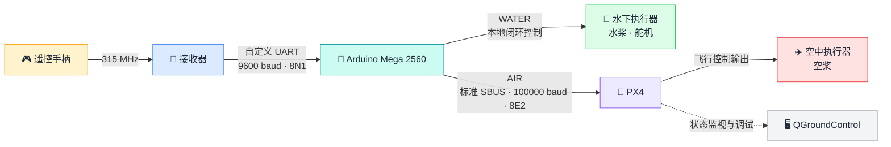

<div align="center">

# 🌊 Hmini 315 遥控与控制链路

**以 Arduino Mega 2560 作为 315 MHz 遥控数据的统一入口：Arduino 直接控制水下执行器，并通过标准 SBUS 将遥控数据转发至 PX4，由 PX4 控制空中执行器。**


</div>

---

## 📖 项目简介

本项目实现了统一遥控输入和相互隔离的水下、空中控制链路：



Arduino负责接收并校验24字节遥控数据帧，完成解扰、10路通道解析、数值映射和控制模式管理。
WATER模式下，Arduino结合IMU与深度数据直接控制水桨和舵机；
AIR模式下，Arduino通过标准SBUS将实时通道发送至PX4，由PX4控制空中执行器。
手柄在线且处于STOP/WATER时，Arduino向PX4持续发送有效的安全中立SBUS帧；只有315真实断联时才置位SBUS Failsafe。

> [!IMPORTANT]
> 当前代码已启用完整外设模式。必须拆除桨叶并确认舵机机构无碰撞后再上电；STOP和AIR模式会持续输出安全位置，只有从STOP安全切入WATER且传感器检查通过时才会自动启用本地执行器。

## ✅ 当前进度

| 模块 | 状态 | 说明 |
|---|:---:|---|
| 315 MHz 接收器 UART 接收 | ✅ | `Serial3`，9600 baud，8N1 |
| 帧同步、CRC-8 校验与 BD/DB 解扰 | ✅ | 坏帧不会覆盖最近一次有效通道 |
| 10 路遥控通道解析 | ✅ | 4 路 11 位摇杆 + 6 路 6 位辅助通道 |
| Arduino → PX4 标准 SBUS | ✅ | `Serial2`，100000 baud，8E2，约 71.4 Hz |
| PX4 / QGroundControl 通道验证 | ✅ | 可通过 `input_rc` 观察通道和失控状态 |
| 200 ms 断联检测与 SBUS Failsafe | ✅ | 油门及 AUX 置低，姿态通道回中 |

## 🔌 硬件连接

| 起点 | 终点 | 信号 / 参数 |
|---|---|---|
| 315 接收器 `OUT` | Mega `D15 / RX3` | UART，9600 baud，8N1 |
| Mega `D16 / TX2` | 板卡 `SOUT` | 未反相 SBUS UART，100000 baud，8E2 |
| 板卡 `SOUT` | PX4 `RC/SBUS IN` | 经过反相与 3.3 V 电平适配的标准 SBUS |
| Arduino `GND` | 接收器及 PX4 `GND` | 必须共地 |
| Mega USB | 电脑 | 调试串口，115200 baud |
| 前深度水桨 ESC | Mega `D7` | `esc1`，深度/俯仰 |
| 后深度水桨 ESC | Mega `D10` | `esc2`，深度/俯仰 |
| 左偏航水桨 ESC | Mega `D8` | `esc3`，前进/偏航 |
| 右偏航水桨 ESC | Mega `D9` | `esc4`，前进/偏航 |

> [!CAUTION]
> 标准 SBUS 使用**反相逻辑**。Arduino Mega 的硬件 UART 不会自动反相，因此 `D16 / TX2` 应经过板卡的 `SOUT` 反相和电平适配电路后再连接 PX4，不能默认将裸 UART TX 直接接入 PX4 的 SBUS 引脚。

## 📦 数据与控制链路

### 接收器 → Arduino

接收器输出固定 24 字节帧：

```text
00 | AD AD AD AD AD | FE | 10 | CRC | Data'[12] | BD DB BD
```

- CRC：初值 `0x00`，多项式 `0x31`，仅覆盖线上 `Data'[12]`
- 解扰：`Data'[i] XOR {BD, DB, BD, DB, ...}`
- 通道：`CH1～CH4` 使用 11 位精度，`CH5～CH10` 使用 6 位精度
- 附加字段：11 位帧序号和 5 位保留字段

### Arduino → 水下执行器

- WATER模式且启动联锁、IMU和深度数据均有效时，Arduino启用本地水下控制
- 深度、俯仰和航向PID分别参与垂直水桨与水平推进桨控制
- CH10给出左右互补舵机的目标位置，实际输出经过非阻塞斜坡限速
- AIR、STOP、断联或传感器异常时，本地执行器恢复安全输出

### Arduino → PX4 → 空中执行器

- 输出标准 25 字节 SBUS 帧
- `CH1～CH10` 保持接收器通道原顺序
- 除诊断用 `CH14` 外，`CH11～CH16` 默认置于补偿后的安全中位
- `CH14` 用作 11 位循环帧计数，仅供链路诊断
- AIR模式下向PX4转发实时通道，由PX4完成飞行控制并驱动空中执行器
- STOP/WATER且315在线时发送姿态回中、油门最低的有效SBUS帧，`lost_frame=false`、`failsafe=false`
- 超过200 ms未收到有效315数据帧时才置位`lost_frame`和`failsafe`

更完整的帧结构、位域、映射算法和状态机说明请参阅：

📘 [Hmini_315 代码架构与 315 接收说明](docs/Hmini_315_代码架构与315接收说明.md)

## 🎛️ 通道映射

| PX4 / SBUS | Arduino | 手柄操作 | 数值范围 |
|---|---|---|---:|
| CH1 — Yaw | `ch[0]` | 右摇杆左右 | 1000～2000 |
| CH2 — Pitch | `ch[1]` | 右摇杆上下 | 1000～2000 |
| CH3 — Throttle | `ch[2]` | 左摇杆上下 | 1000～2000 |
| CH4 — 未分配 | `ch[3]` | 左摇杆左右 | 1000～2000 |
| CH5 | `ch[4]` | 左扳机 SA | 1000 / 2000 |
| CH6 | `ch[5]` | 左三档开关 SB | 1000 / 1492 / 2000 |
| CH7 | `ch[6]` | 右三档开关 SC | 1000 / 1492 / 2000 |
| CH8 | `ch[7]` | 右扳机 SD | 1000 / 2000 |
| CH9 | `ch[8]` | 左扳机 SE | 1000 / 2000 |
| CH10 | `ch[9]` | 右旋钮 SI | 1000～2000 |

> `1492` 是 6 位辅助通道映射后的正常物理中位；发送 SBUS 时会单独补偿，使 PX4 端显示约为 `1500`。
>
> CH4目前没有对应的SBUS控制功能。代码仍保留并转发其原始通道值，便于后续分配，但PX4不应将CH4绑定到模式、参数或执行器。

### 本地水下控制映射

| 手柄通道 | 水下控制量 | 作用 |
|---|---|---|
| CH1 | `yaw_315` | 左右水平推进桨差动偏航 |
| CH2 | `pitch_315` | 沿用旧变量名，实际为前后推进 Surge |
| CH3 | `depth_d_315` | ≤1050关闭垂直水桨；1050～2000映射0.0～1.0 m |
| CH7 / SC | `control_mode` | 后档 AIR、中档 STOP、前档 WATER |
| CH10 / SI | `angle` | 端点请求；每次动作锁定到完成，输出以400 us/s移动 |

CH3底部≤1050是明确的垂直水桨停机区，前后垂直水桨强制输出1490 us，深度和俯仰闭环均不参与；超过1050后才进入绝对深度控制。该设计可避免台面或水面测试时因气压漂移、深度零点误差和姿态误差造成水桨转动。代价是机器人在水下把CH3拨到底时不会主动推到水面，只能依靠自身浮力。

CH7 后档（≤1250）为 AIR，Arduino 本地执行器保持安全输出并向PX4转发实时SBUS；中档为 STOP；前档（≥1750）为 WATER。STOP会立即禁用本地电机和舵机控制；STOP和WATER向PX4发送有效的安全中立帧，避免因主动模式隔离持续触发PX4 RC Failsafe报警。

> [!WARNING]
> 安全中立SBUS帧表示油门通道最低，并不等价于PX4电机输出端的“0 PWM”。若PX4已经解锁，具体机型和参数仍可能保持电机怠速。台架测试必须拆桨并保持PX4未解锁。

每次从STOP进入WATER都必须重新通过入水联锁：CH1和CH2位于1470～1530、CH3≤1050且IMU与深度数据新鲜。检查通过后自动启用本地执行器，不再需要USB串口ARM命令。315失联、切回STOP/AIR、IMU超时或深度数据无效会重新锁定水下输出。

当前手柄右旋钮只产生1000/2000两个端点，因此代码使用“端点动作锁存”：

- 空闲时读取旋钮并锁定本次端点；
- 每20 ms以`SERVO_SLEW_US_PER_SECOND = 400` us/s向锁定端点移动，完整行程约2.5秒；
- 动作过程中忽略全部旋钮变化，禁止中途反向；
- 到达端点后强制停留`SERVO_ENDPOINT_DWELL_MS = 500` ms；
- 停留结束后只读取旋钮当时的最终状态，若需要才启动下一次完整动作，中途切换不会形成命令队列；
- STOP、AIR、失联或传感器故障会绕过斜坡并立即回到1000/2000安全位置。

动作锁存只能避免频繁反向，不能防止机械堵转。必须确认1000/2000 us没有把连杆顶在物理限位上，否则舵机到位后仍会持续大电流发热。

## 🚀 快速开始

### 1. 准备环境

- Arduino Mega 2560
- Arduino IDE 与 Arduino AVR Boards 支持包
- Bolder Flight Systems SBUS 库（代码使用 `sbus.h`、`bfs::SbusTx`）
- 315 MHz 接收器与带 SBUS 输入的 PX4 飞控
- QGroundControl

`Wire`、`SPI`、`SD` 和 `Servo` 为 Arduino 内置库；MS5837 驱动已包含在仓库中。

### 2. 打开并上传草图

1. 使用 Arduino IDE 打开 `Hmini_315/Hmini_315.ino`。
2. 开发板选择 **Arduino Mega or Mega 2560**。
3. 确认主草图使用完整外设模式：

   ```cpp
   #define RX315_BENCH_TEST_ONLY 0
   ```

   完整模式会初始化传感器、ESC和舵机。上电默认`DISARMED`，STOP/AIR保持安全输出，从STOP安全进入WATER后自动变为`ARMED`。

4. 拆除所有桨叶，确认舵机启动位置不会碰撞机械限位。
5. 选择正确串口并编译、上传。
6. 打开 115200 baud 串口监视器。

串口命令支持“换行”“回车”或“两者同时”作为行结束符；“无行结束符”不会执行命令。

正常连接后可以看到类似输出：

```text
EVENT,sbus=FAILSAFE,reason=STARTUP
EVENT,actuators=DISARMED,reason=STARTUP
EVENT,rx=CONNECTED,frames_ok=...,seq=...
EVENT,sbus=NEUTRAL,reason=STOP_MODE
EVENT,mode=AIR,ch7=1000,rx=CONNECTED
EVENT,sbus=ACTIVE,reason=AIR_MODE
```

周期日志默认关闭。通过串口命令按需查看：

| 命令 | 输出 |
|---|---|
| `help` | 命令帮助 |
| `status` | 单次系统状态 |
| `channels` | 单次手柄与控制映射 |
| `watch channels on/off` | 开启/关闭5 Hz `CHANNELS` |
| `watch link on/off` | 开启/关闭1 Hz `LINK` |
| `watch all off` | 关闭全部周期输出 |

`watch channels on`只在315数据有效时保持5 Hz输出；手柄断连时输出一次`CHANNELS,rx=DISCONNECTED,...`后暂停，重新连接后自动恢复。

`CHANNELS`使用物理控件和水下语义组合名称，避免重复列出原始通道与映射值：

```text
CHANNELS,RSX/YAW=1500,RSY/SURGE=1500,LSY/DEPTH=1000/0.000m,LSX=1500,SA=1000,SB=1000,SC/MODE=1492/STOP,SD=1000,SE=1000,SI=1000,SERVO_REQUEST=1000:2000,SERVO_LATCHED=1000:2000,SERVO_OUTPUT=1000:2000,SERVO_MOVING=0,WATER=LOCKED,ACTUATORS=DISARMED,VERTICAL=OFF
```

其中 `RSX/RSY` 是右摇杆横/纵轴，`LSX/LSY` 是左摇杆横/纵轴；`SERVO_REQUEST`是旋钮当前请求，`SERVO_LATCHED`是本次动作锁定且运动中不可更改的目标，`SERVO_OUTPUT`是实际脉宽。

### 3. 在 PX4 / QGC 中验证

1. 将 PX4 通过 USB 连接到电脑。
2. 在 QGroundControl 中进入 `Vehicle Setup → Radio` 观察通道。
3. 也可以在 MAVLink Console 中运行：

   ```text
   listener input_rc -n 20
   ```

CH7置于AIR档时的预期结果：

- 操作手柄时，CH1～CH10 随对应控件变化；
- 正常连接时 `rc_failsafe=false`；
- 关闭手柄超过 200 ms 后 `rc_failsafe=true`；
- 恢复连接后通道与状态自动恢复。

CH7置于STOP或WATER档且315在线时，Arduino会发送姿态回中、油门最低且`failsafe=false`的`NEUTRAL`帧。关闭手柄或315链路超过200 ms无有效帧后，才发送`failsafe=true`。

> [!NOTE]
> 请使用 QGC 的 **Radio** 页面验证飞控收到的 RC 数据；**Joystick** 页面用于电脑 USB/HID 手柄，不适用于本链路。

## 🛡️ 失控保护

当接收器噪声仍存在但没有通过 CRC 和帧尾校验的有效帧时，系统不会误判为在线。最后一帧有效数据超过200 ms时，Arduino持续发送真正的Failsafe SBUS帧：

- Roll、Pitch、Yaw：回中
- Throttle：最低
- CH5～CH10：最低
- `lost_frame=true`
- `failsafe=true`

重新收到有效帧后，系统会自动恢复实时通道输出。

如果恢复时手柄位于STOP/WATER，SBUS状态先恢复为`NEUTRAL`；只有AIR模式才恢复为`ACTIVE`并转发实时通道。

本地水下执行器总锁不写入EEPROM，每次上电均为`DISARMED`。从STOP切入WATER且入口和传感器检查通过后自动变为`ARMED`；315失联、切回STOP/AIR、IMU超时或深度超时都会自动恢复安全输出并切回`DISARMED`。恢复后必须先回STOP，再重新安全进入WATER。

## 🗂️ 仓库结构

```text
Hmini_315/
├─ Hmini_315.ino                  主程序入口与台架模式
├─ RX315.ino                      接收、校验、解扰和通道解析
├─ SerialConsole.ino              USB串口命令与按需诊断
├─ sbus.ino                       标准 SBUS 输出与 Failsafe
├─ WaterControl315.ino            保留的水下动力控制逻辑
├─ YawCtrl.ino                    姿态、深度 PID 与跟踪微分器
├─ MS5837.*                       Bar30 深度传感器驱动
├─ imu_data_decode.* / packet.*   IMU 串口协议解析
├─ tools/RX315_Diagnostics/       原始脉冲与 UART 诊断草图
├─ docs/                          详细代码与协议文档
├─ 315/                           STM32 发送端与 PX4 直连驱动参考
└─ README.md
```

Arduino IDE 会自动合并 `Hmini_315/` 目录中的所有 `.ino` 文件进行编译；`tools/` 和 `legacy/` 中的文件不会进入主草图构建。

## 🔍 诊断提示

- **完全没有输入字节**：检查接收器 `OUT → D15/RX3`、供电和共地。
- **持续出现 CRC 错误**：检查波特率、电平、干扰和接收器协议版本。
- **Arduino 通道正常但 PX4 无输入**：重点检查 SBUS 反相、电平适配和 PX4 的 RC/SBUS 端口配置。
- **查看手柄映射**：发送 `channels`，或使用 `watch channels on` 持续观察；结束后发送 `watch channels off`。
- **查看链路错误计数**：使用 `watch link on`；结束后发送 `watch link off`。
- **需要抓取原始信号**：使用 `Hmini_315/tools/RX315_Diagnostics/RX315_Diagnostics.ino`。
- **PX4 中位或端点偏移**：根据实际硬件重新标定 `SBUS_PX4_MIN/MID/MAX`。

> [!WARNING]
> `CH14` 是诊断帧计数，不是 PWM 控制通道。请勿将其分配给飞行模式、AUX passthrough、参数调节或任何执行器。

## 🧭 下一阶段

- [x] 完成 315 通道到水下控制变量的映射
- [x] 增加 AIR / STOP / WATER 隔离和入水联锁
- [x] 增加台架控制预览与安全边界日志
- [ ] 断桨确认通道方向、中位死区和输出方向
- [ ] 完成执行器上电与断联安全检查
- [ ] 恢复并联调 IMU、Bar30 和 SD 日志
- [ ] 开展整机水下控制测试

---

<div align="center">

**通信先可靠，动力再上电。** ⚡🛟

</div>
