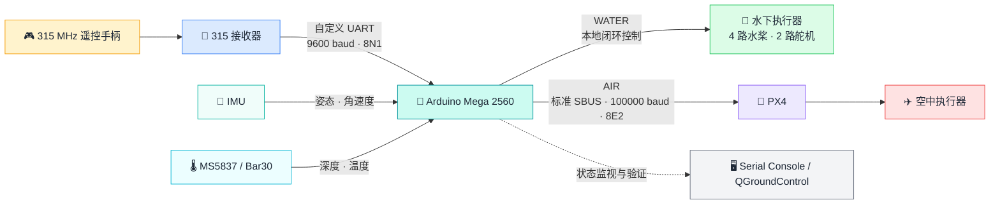
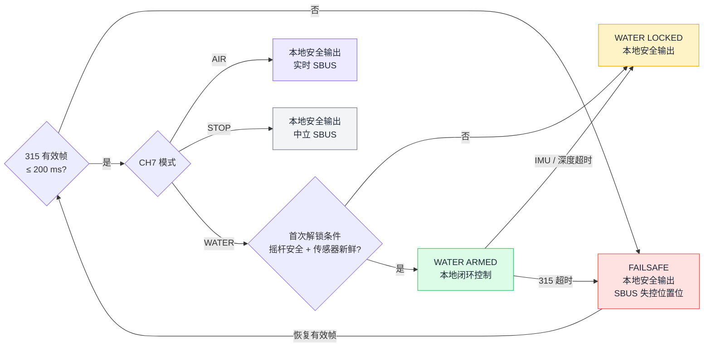

<div align="center">

# 🌊 Hmini 315 空水两栖遥控与控制链路

**基于 Arduino Mega 2560 的双域控制系统：解析自定义 315 MHz 遥控协议，在水下执行本地闭环控制，在空中通过标准 SBUS 接入 PX4。**


</div>

## 🌊 项目简介

Hmini 315 面向同时具备空中与水下执行机构的两栖平台。系统使用同一套 315 MHz 遥控输入，在 Arduino 上完成协议解析、模式管理和安全隔离，并根据当前工作域选择不同的控制路径：

- **AIR**：Arduino 将实时遥控通道转换为标准 SBUS，由 PX4 完成飞行控制；
- **WATER**：Arduino 融合 IMU 与深度数据，直接控制四路水桨和两路舵机；
- **STOP**：隔离实时控制指令，使本地执行器和 PX4 输入进入定义明确的安全状态。

这个项目的核心并不是简单转发遥控数据，而是在资源受限的 AVR 平台上，将私有无线协议、标准飞控接口、水下闭环控制、模式状态机和失控保护整合为一条可诊断的控制链路。

## 🎯 项目目标与技术挑战

- 315 MHz 接收器输出自定义串口数据帧，无法直接接入 PX4，需要完成帧结构分析、校验、解扰和位域解析。
- 空中与水下执行器共享同一遥控器，但控制权必须互斥，避免跨工作域误动作。
- 水下控制依赖 IMU 和 Bar30 深度数据，传感器超时不能继续沿用旧控制量。
- 主动选择 STOP/WATER 不应被 PX4 误判为遥控失联，真实断联又必须可靠触发 RC Failsafe。
- 系统需要提供足够的运行时状态和错误计数，使协议、控制和硬件问题能够分层定位。

## 🧭 系统架构



| 数据路径 | 主要职责 |
|---|---|
| 315 Receiver → Arduino | 帧同步、CRC 校验、解扰、位域提取和通道映射 |
| Arduino → PX4 | PWM 风格通道值补偿、SBUS 编码和链路状态传递 |
| IMU / Bar30 → Arduino → 水下执行器 | 姿态与深度反馈、PID 计算、推进器混控和舵机控制 |
| Arduino → Serial / QGC | 事件日志、状态查询、错误计数和端到端验证 |

## 📊 核心技术指标

| 项目 | 当前实现 |
|---|---|
| 主控平台 | Arduino Mega 2560 / ATmega2560 |
| 接收接口 | `Serial3`，9600 baud，8N1 |
| 接收帧 | 固定 24 字节自定义帧 |
| 通道数据 | 10 路：4 路 11 位 + 6 路 6 位 |
| 完整性校验 | 帧同步、CRC-8、帧尾校验 |
| 数据解扰 | `0xBD / 0xDB` 交替异或 |
| 飞控接口 | 标准 25 字节 SBUS |
| SBUS 输出 | `Serial2`，100000 baud，8E2，14 ms 周期（约 71.4 Hz） |
| 控制模式 | AIR / STOP / WATER |
| 断联判定 | 200 ms 内无有效 315 数据帧 |
| 传感器时效 | IMU 与深度数据分别进行 250 ms 新鲜度检查 |
| 本地控制 | 深度、俯仰、航向 PID 与四水桨混控 |

## 🛠️ 核心工程贡献

| 方向 | 实现内容 |
|---|---|
| 私有协议解析 | 实现流式帧同步、CRC-8、BD/DB 解扰、跨字节位域提取和序号丢帧统计 |
| 飞控协议桥接 | 将 10 路遥控数据转换为标准 SBUS，并针对 PX4 实测端点进行数值补偿 |
| 双域状态管理 | 设计 AIR / STOP / WATER 三态隔离，明确本地执行器和 PX4 在各模式下的数据来源 |
| 水下闭环控制 | 将遥控目标、IMU 姿态与 Bar30 深度接入 PID 和推进器混控 |
| 安全机制 | 实现上电总锁、入水联锁、有效帧超时、传感器超时和 SBUS Failsafe |
| 可观测性 | 建立事件日志、状态命令、通道监视、链路错误计数和原始信号诊断工具 |

## 🧩 核心技术实现

### 📡 1. 自定义 315 MHz 协议解析

接收器输出固定 24 字节数据帧：

```text
00 | AD AD AD AD AD | FE | 10 | CRC | Data'[12] | BD DB BD
```

Arduino 使用状态机从连续 UART 字节流中恢复帧边界，并完成以下处理：

1. 校验同步头、长度字段和三字节帧尾；
2. 使用初值 `0x00`、多项式 `0x31` 的 CRC-8 校验线上 `Data'[12]`；
3. 通过 `BD / DB` 交替异或恢复原始 12 字节数据；
4. 从非字节对齐位域中提取 4 路 11 位通道、6 路 6 位通道、11 位帧序号和 5 位保留字段；
5. 将通道统一映射到 1000～2000 的 PWM 风格数值。

链路在线状态不以 `Serial3.available()` 为依据。即使手柄关闭后接收器仍产生噪声，只有通过全部校验的有效帧才能刷新 200 ms 链路计时器。CRC 或帧尾错误只增加诊断计数，不会覆盖最近一次有效控制数据。

### 🔁 2. 标准 SBUS 协议桥接

Arduino 将解析后的 CH1～CH10 按原顺序编码为标准 25 字节 SBUS，通过 `Serial2` 以 100000 baud、8E2 输出：

- 对 11 位摇杆通道和 6 位辅助通道分别进行分段映射；
- 补偿辅助通道物理中位 `1492`，使 PX4 端显示接近 `1500`；
- 使用实测标定点，将本地 1000 / 1500 / 2000 映射到 PX4 接收端点；
- CH11～CH16 默认保持安全中位，CH14 例外承载 11 位循环帧计数；
- 通过 QGroundControl `Radio` 页面和 PX4 `input_rc` 完成端到端验证。

标准 SBUS 使用反相逻辑，因此 Mega `D16 / TX2` 经过板卡 `SOUT` 的反相和 3.3 V 电平适配后再进入 PX4 `RC/SBUS IN`。

### 🔀 3. AIR / STOP / WATER 状态隔离

同一遥控输入在三个模式下产生不同的数据路径：



| 状态 | Arduino 本地执行器 | PX4 接收内容 | SBUS 状态 |
|---|---|---|---|
| AIR | 安全输出 | 实时 CH1～CH10 | `ACTIVE` |
| STOP | 安全输出 | 姿态回中、油门与 AUX 置低 | `NEUTRAL` |
| WATER（未解锁） | 安全输出 | 姿态回中、油门与 AUX 置低 | `NEUTRAL` |
| WATER（已解锁） | 本地闭环控制 | 姿态回中、油门与 AUX 置低 | `NEUTRAL` |
| 315 断联 | 安全输出并重新锁定 | 安全通道值 | `FAILSAFE` |

这里将“主动模式隔离”和“真实无线链路失效”明确分开：STOP/WATER 仍发送 `lost_frame=false`、`failsafe=false` 的有效安全中立帧，只有 315 链路超过 200 ms 无有效帧时才同时置位两个失控标志。

### 🌊 4. 水下闭环与推进器混控

WATER 模式下，Arduino 将遥控目标与传感器反馈组合为本地控制量：

- CH1 提供手动偏航差动量；
- CH2 控制前进 / 后退 Surge，并在推进开始时锁定航向目标；
- CH3 ≤1050 时关闭垂直水桨，超过阈值后映射为 0～1 m 绝对深度目标；
- IMU 提供欧拉角和角速度，Bar30 提供相对深度；
- PID 分别计算深度、俯仰和航向修正量；
- 前后垂直桨执行“深度 ± 俯仰”混控，左右水平桨执行“Surge ± 偏航”混控。

当前四推进器布局没有将横滚 PID 输出混入执行器。代码保留横滚误差计算，但实际控制能力聚焦于深度、俯仰和航向，避免在项目展示中把尚不具备的执行能力描述为已实现。

### 🔒 5. 执行器安全联锁

本地执行器总锁每次上电均从 `DISARMED` 开始。进入 WATER 后，只有满足以下条件才自动启用：

- CH1、CH2 位于 1470～1530；
- CH3 ≤1050，垂直桨处于停机区；
- 315 数据有效；
- IMU 和深度数据均新鲜。

315 失联、切换到 STOP/AIR、IMU 超时或深度超时都会立即恢复安全输出并撤销解锁。左右互补舵机采用非阻塞斜坡和端点动作锁存，以 500 us/s 移动；运动中忽略目标反向，到位后停留 500 ms 再接受下一次动作。

### 🖥️ 6. 运行时诊断

诊断体系同时覆盖协议层、状态层和控制层：

- `EVENT` 日志只在连接、模式、SBUS 或执行器状态变化时输出；
- `status` 汇总模式、联锁、传感器新鲜度和 SBUS 状态；
- `channels` 显示物理控件、水下语义与执行器目标；
- `watch channels` 和 `watch link` 按需输出周期数据；
- CRC、帧尾、同步和序号丢失分别计数；
- `tools/RX315_Diagnostics/` 可独立抓取原始脉冲或探测 UART 字节。

## 🧰 技术栈

| 类别 | 技术与组件 |
|---|---|
| 嵌入式平台 | Arduino Mega 2560、ATmega2560 |
| 开发语言 | C / C++、Arduino Framework |
| 无线输入 | 315 MHz 接收器、自定义 UART 协议 |
| 飞控接口 | Standard SBUS、PX4 |
| 传感器 | IMU、MS5837 / Bar30 |
| 控制算法 | PID、跟踪微分器、航向保持、深度闭环、推进器混控 |
| 调试验证 | Serial Console、QGroundControl、MAVLink Console |
| 工程机制 | 流式状态机、CRC-8、Failsafe、数据新鲜度检测、非阻塞执行器控制 |

## ✅ 实现与验证状态

| 项目 | 状态 | 当前边界 |
|---|:---:|---|
| 315 帧解析与 10 路通道恢复 | ✅ 已实现 | 包含 CRC、帧尾、同步和序号诊断 |
| Arduino → PX4 标准 SBUS | ✅ 已验证 | 已在 QGroundControl / `input_rc` 观察通道 |
| 200 ms 断联与 PX4 RC Failsafe | ✅ 已验证 | 断联与恢复状态可自动切换 |
| AIR / STOP / WATER 模式隔离 | ✅ 已实现 | ACTIVE / NEUTRAL / FAILSAFE 状态分离 |
| 水下 PID 与四水桨混控 | 🟡 已集成 | 尚待整机水下控制测试 |
| 入水联锁与传感器超时保护 | 🟡 代码完成 | 尚待执行器带载和断联安全验证 |
| IMU、Bar30 与 SD 日志 | 🟡 已接入 | 尚待恢复完整联合调试 |

## 🗂️ 代码架构

```text
Hmini_315/
├─ Hmini_315.ino                  集成层：外设初始化、主循环调度与执行器总锁
├─ ControlState.h                 接口层：模式、状态和跨模块控制接口
├─ RX315.ino                      接收层：帧同步、CRC、解扰和通道解析
├─ sbus.ino                       输出层：SBUS 编码、PX4 数值补偿和 Failsafe
├─ WaterControl315.ino            控制层：模式状态机、入水联锁和水下混控
├─ YawCtrl.ino                    算法层：PID 与跟踪微分器
├─ SerialConsole.ino              诊断层：事件、状态、通道和链路监视
├─ imu_data_decode.* / packet.*   驱动层：IMU 串口协议解析
├─ MS5837.*                       驱动层：Bar30 深度与温度采集
├─ tools/RX315_Diagnostics/       工具：原始脉冲捕获与 UART 探测
├─ docs/                          使用、协议和代码架构文档
└─ 315/                           STM32 发送端与 PX4 直连驱动参考
```

主程序按“接收 → 模式更新 → SBUS 输出 → 传感器更新 → 安全检查 → 水下控制”的顺序运行，各模块通过 `ControlState.h` 暴露的接口协作，避免接收解析、输出协议和执行器逻辑相互耦合。

## 🚧 当前边界与后续计划

- 断桨确认通道方向、中位死区和四路推进器输出方向；
- 完成执行器上电、带载和断联安全检查；
- 恢复并联调 IMU、Bar30 与 SD 日志；
- 开展整机水下控制测试并整定 PID 参数；
- 在有实测数据后补充长期丢帧率、控制周期抖动和水下跟踪误差等量化指标。

## 📚 延伸文档

| 文档 | 内容 |
|---|---|
| [使用、安全与调试指南](docs/使用、安全与调试指南.md) | 硬件接线、编译上传、模式联锁、串口命令、PX4 验证与故障排查 |
| [代码架构与 315 接收说明](docs/Hmini_315_代码架构与315接收说明.md) | 接收协议、位域、映射算法、模块职责和调用流程 |

> [!IMPORTANT]
> 本项目包含动力执行器。接线、上电或台架测试前，请先阅读使用与安全指南并拆除全部桨叶。

---

<div align="center">

**从私有遥控协议到双域闭环控制：通信可验证，状态可隔离，故障可回退。**

</div>
