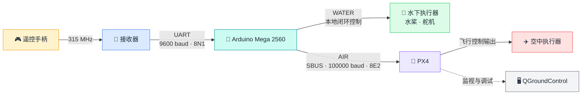

<div align="center">

# 🌊 Hmini 315 遥控与控制链路

**以 Arduino Mega 2560 统一接收 315 MHz 遥控数据：本地控制水下执行器，并通过标准 SBUS 将空中控制指令转发至 PX4。**


</div>

## 📖 项目概览



Arduino 校验并解析 24 字节接收帧，得到 10 路遥控通道。AIR 模式将实时通道转为标准 SBUS 交给 PX4；WATER 模式结合 IMU 和深度数据控制本地水桨与舵机；STOP 模式隔离两类动力输出。

### ✅ 当前状态

| 模块 | 状态 | 说明 |
|---|:---:|---|
| 315 MHz UART 接收 | ✅ | `Serial3`，9600 baud，8N1 |
| 帧同步、CRC-8 校验与解扰 | ✅ | 无效帧不会覆盖最近一次有效通道 |
| 10 路通道解析 | ✅ | 4 路 11 位摇杆 + 6 路 6 位辅助通道 |
| Arduino → PX4 标准 SBUS | ✅ | `Serial2`，100000 baud，8E2，约 71.4 Hz |
| PX4 / QGroundControl 验证 | ✅ | 可通过 `input_rc` 检查通道与失控状态 |
| 断联保护 | ✅ | 200 ms 无有效帧后进入 SBUS Failsafe |

## 🛡️ 安全须知

> [!IMPORTANT]
> 当前代码启用了完整外设模式。首次上电和台架测试前必须拆除全部桨叶，确认舵机全行程不会碰撞机械限位，并保持 PX4 未解锁。

- 上电后本地执行器默认为 `DISARMED`。
- 只有从 STOP 切入 WATER，且摇杆、深度指令和传感器检查均通过时，水下执行器才会自动启用。
- STOP、AIR、315 失联或传感器异常都会使本地执行器回到安全输出。
- STOP/WATER 下的 SBUS 安全中立帧不等于 PX4 输出端的 `0 PWM`，PX4 侧仍须保持正确的解锁与失控保护配置。
- Mega 的 UART 不会自动输出反相 SBUS；`D16 / TX2` 必须经过板卡 `SOUT` 的反相和 3.3 V 电平适配后再接 PX4。

完整的接线、联锁条件和断联行为见[使用、安全与调试指南](docs/使用、安全与调试指南.md)。

## 🚀 快速开始

### 🧰 1. 准备

- Arduino Mega 2560
- Arduino IDE 与 Arduino AVR Boards 支持包
- Bolder Flight Systems SBUS 库（`sbus.h`、`bfs::SbusTx`）
- 315 MHz 接收器、带 SBUS 输入的 PX4 飞控和 QGroundControl

`Wire`、`SPI`、`SD` 和 `Servo` 为 Arduino 内置库；MS5837 驱动已包含在仓库中。

### ⬆️ 2. 编译与上传

1. 使用 Arduino IDE 打开项目根目录的 `Hmini_315.ino`。
2. 开发板选择 **Arduino Mega or Mega 2560**。
3. 确认完整外设模式已启用：

   ```cpp
   #define RX315_BENCH_TEST_ONLY 0
   ```

4. 拆除桨叶并检查舵机机械限位。
5. 选择正确串口，编译并上传。
6. 以 115200 baud 打开串口监视器，发送 `status` 检查状态。

### 🧭 3. 验证 PX4 输入

将 CH7 / SC 置于 AIR 档，在 QGroundControl 的 `Vehicle Setup → Radio` 页面观察通道；也可以在 MAVLink Console 运行：

```text
listener input_rc -n 20
```

正常连接时应看到 CH1～CH10 随控件变化且 `rc_failsafe=false`；关闭手柄超过 200 ms 后应变为 `rc_failsafe=true`。

## 🎛️ 控制速查

### 🔀 模式行为

| CH7 / SC | 模式 | Arduino 本地执行器 | 发送至 PX4 的 SBUS |
|---|---|---|---|
| 后档，≤1250 | AIR | 安全输出 | 实时 CH1～CH10 |
| 中档 | STOP | 安全输出 | 有效安全中立帧 |
| 前档，≥1750 | WATER | 联锁通过后启用 | 有效安全中立帧 |
| 315 断联 | STOP / Failsafe | 安全输出并重新锁定 | `lost_frame=true`、`failsafe=true` |

从 STOP 进入 WATER 时，CH1 和 CH2 必须位于 1470～1530、CH3 必须 ≤1050，且 IMU 与深度数据有效。联锁因断联、模式切换或传感器超时而关闭后，必须重新触发入水联锁：回到 STOP 后再进入 WATER，或让入口安全条件离开后重新满足。

### 🕹️ 关键通道

| 通道 | 手柄控件 | AIR / PX4 | WATER / 本地控制 |
|---|---|---|---|
| CH1 | 右摇杆左右 | Yaw | 水平桨差动偏航 |
| CH2 | 右摇杆上下 | Pitch | 前后推进 Surge |
| CH3 | 左摇杆上下 | Throttle | ≤1050 关闭垂直桨；其余映射 0～1 m 深度 |
| CH7 | 右三档开关 SC | 模式选择 | AIR / STOP / WATER |
| CH10 | 右旋钮 SI | AUX | 左右互补舵机端点请求 |

CH4 当前未分配，但仍按原顺序转发；CH5～CH9 也保留并转发。完整的 10 路映射、舵机锁存行为和串口诊断命令见[使用、安全与调试指南](docs/使用、安全与调试指南.md)。

## 📚 文档导航

| 文档 | 内容 |
|---|---|
| [使用、安全与调试指南](docs/使用、安全与调试指南.md) | 硬件接线、完整通道映射、模式联锁、失控保护、串口命令、PX4 验证与故障排查 |
| [代码架构与 315 接收说明](docs/Hmini_315_代码架构与315接收说明.md) | 目录职责、接收帧格式、CRC 与解扰、通道位域、SBUS 映射和调用流程 |

## 🗂️ 仓库结构

```text
Hmini_315/
├─ Hmini_315.ino                  主程序入口与外设初始化
├─ RX315.ino                      315 接收、校验、解扰和通道解析
├─ WaterControl315.ino            模式管理与水下控制
├─ sbus.ino                       标准 SBUS 输出与 Failsafe
├─ SerialConsole.ino              USB 串口命令与按需诊断
├─ YawCtrl.ino                    姿态、深度 PID 与跟踪微分器
├─ MS5837.*                       Bar30 深度传感器驱动
├─ imu_data_decode.* / packet.*   IMU 串口协议解析
├─ tools/RX315_Diagnostics/       原始脉冲与 UART 诊断草图
├─ docs/                          使用、协议与代码文档
└─ 315/                           STM32 发送端与 PX4 直连驱动参考
```

Arduino IDE 会自动合并根目录中的 `.ino` 文件；`tools/` 和仓库外层的 `legacy/` 不参与主草图构建。

## 🧭 下一阶段

- [x] 完成 315 通道到水下控制变量的映射
- [x] 增加 AIR / STOP / WATER 隔离和入水联锁
- [x] 增加台架控制预览与安全边界日志
- [ ] 断桨确认通道方向、中位死区和输出方向
- [ ] 完成执行器上电与断联安全检查
- [ ] 恢复并联调 IMU、Bar30 和 SD 日志
- [ ] 开展整机水下控制测试

---

<div align="center">

**通信先可靠，动力再上电。** ⚡🛟

</div>
